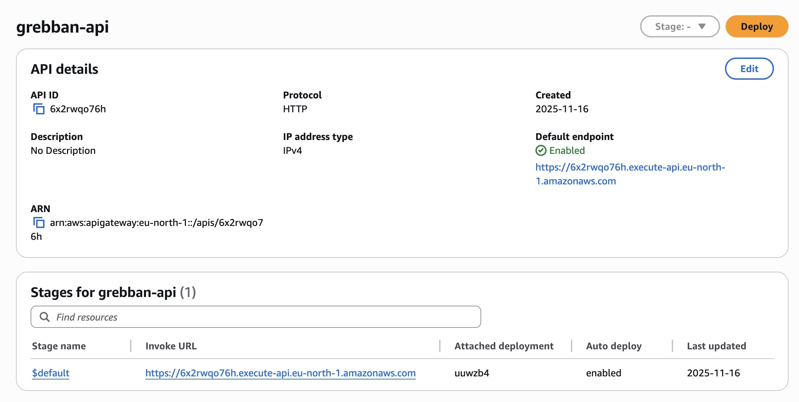

# Grebban Kodtest

### Backendtest - Produktdata

### Hur lång tid tog det att implementera?

Det tog ungefär 2 timmar från start till första fungerande version. Sedan lade jag ytterligare 2 timmar på att förbättra koden och deploja.

### Antaganden och brister

Jag använde mig av Hono som ramverk för att det är enkelt och modernt. Jag funderade på att lägga in datan i en databas men eftersom det här kodtestet inte är så stort så valde jag att behålla datan i json-filer.

Brister jag kan se är att jag inte har lagt till någon validering eller bättre felhantering.

Hade jag haft mer tid hade jag nog lagt till små tester och kanske caching för varje kombination av page och page_size.

### Vad är du mest nöjd med tekniskt?

Det jag är mest nöjd med är min refaktorering av hur attributen mappas till produkterna. Jag hade en lösning som fungerade för det här kodtestet där det bara kunde finnas en huvudkategori och en underkategori. Men jag skrev om koden och gjorde en mer generell lösning som klarar av flera nivåer av kategorier. T.ex. "Cars > Hybrids > Mild Hybrids".

### Bonus

Jag deplojade mitt API till en lambda på AWS med hjälp av SST
[https://grebban.sixten.app/api/products](https://grebban.sixten.app/api/products)

### Instruktioner för att köra lokalt

1. Klona repot
2. Skapa en `.env`-fil i rotmappen med innehållet från `example.env`
3. Kör `npm install`
4. Kör `npm run dev`
5. Gå till [`http://localhost:3000/api/products`](http://localhost:3000/api/products)
